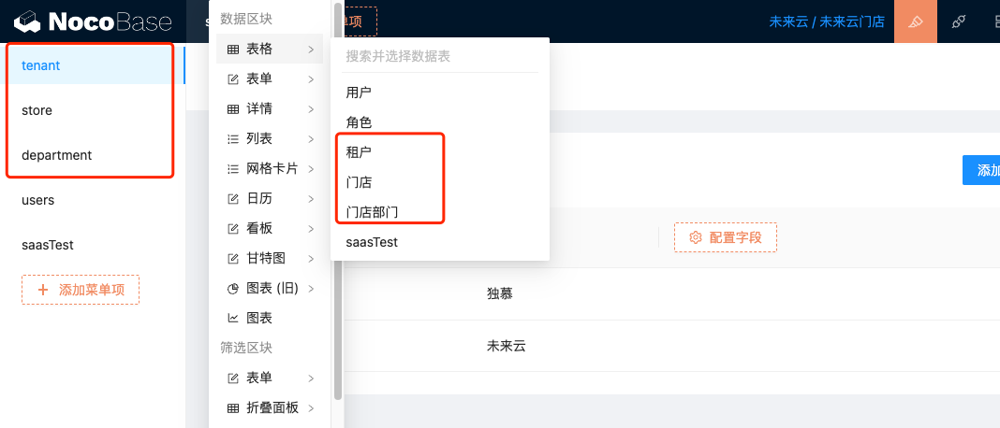
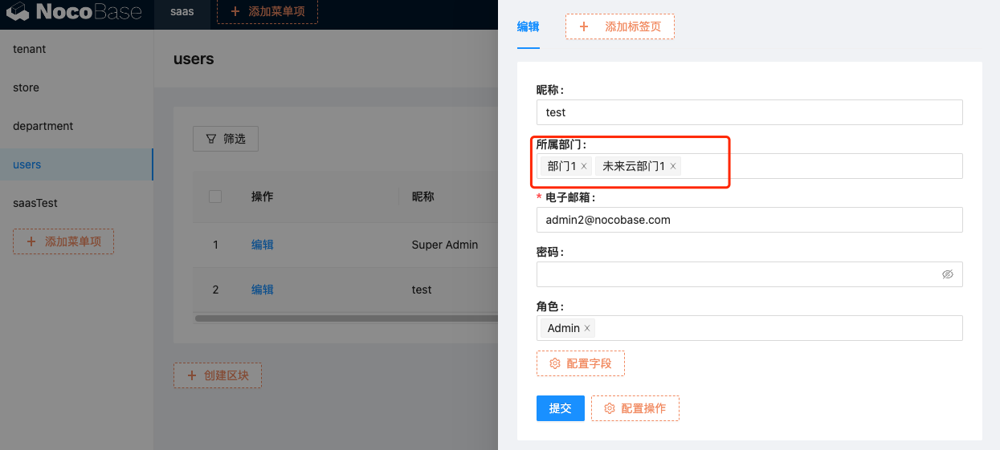
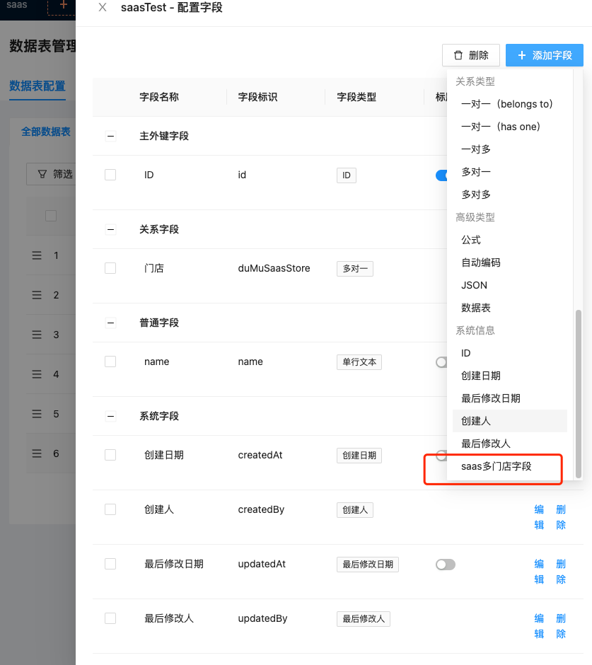
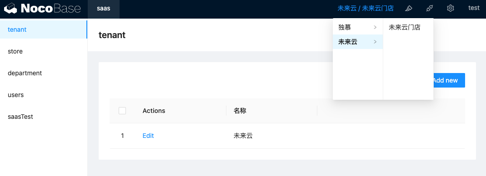
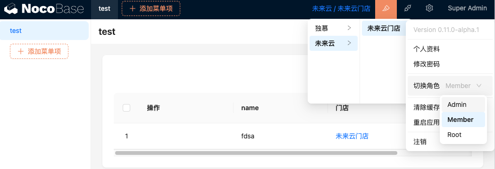

# SAAS 多门店插件

对数据表开启saas多门店后会自动创建一个多门店字段
门店中的用户增加数据会对数据自动带上门店id、删改查都会校验门店id

### 注册安装

``` shell
cd packages/plugins
git clone git@github.com:nocobase-dumu-plugins/dumu-saas-store.git
yarn
yarn pm add dumu-saas-store
yarn pm enable dumu-saas-store (可不执行，在插件管理中开启)
```
### 使用说明
#### 配置租户、门店、部门等

#### 为用户分配部门（root账号不受门店限制，可以由root账号为门店分配一个账号后，由此账号创建门店的其他账号）

#### 创建业务数据模型，为需要进行多门店管理的模型添加多门店字段


#### 多门店效果
如果只有一个门店只会显示门店名字不能切换
如果只在一个租户下，切换为一级
如果在多个租户下，切换为二级级联



> 仅使用本插件可能无法完全做到多门店的数据隔离，还需要配合 `nocobase` 自身的角色和权限去配置对应的逻辑
> 
